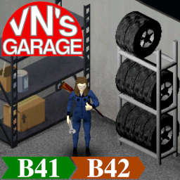

# Veracious Network's Garage (Project Zomboid Mod)

Links

---

Veracious Network's Garage is a mod for Project Zomboid that provides the following features:

* Tire rack
* Battery Shelf with integrated charger
* (more to come)  Currently adding all of KI5 Vehicle and will add more from other Authors as well.

* KI5 Vehicles DONE 100% ****

## Tire Rack

The tire rack is a storage container that can hold up to 12 tires, (or more if you are organized).
This is a 1x1 tile object that can be placed on the ground and accepts just tires.

A notable feature of this tire rack is that it displays the amount of tires stored.
ie: if you store 5 tires, you will see 5 tires on the rack.

## Installation

* Mod Name = VNGarage
* ModID = 3133520800

## Development

Check the [Development Guide](DEVELOPMENT.md) for information on working with this repository.

## License

Code is released under the AGPLv3.

Some image sprites are directly based off game assets from The Indie Stone, and are included for non-commercial use
to be used within Project Zomboid only.
Thanks to The Indie Stone for creating [Project Zomboid](http://projectzomboid.com/), which made this possible.
This is an unofficial fan production for non-commercial purposes made under
[the Indie Stone Terms](https://theindiestone.com/forums/index.php?/topic/2530-mod-permissions/#comment-36481).
