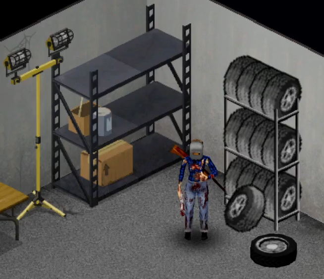
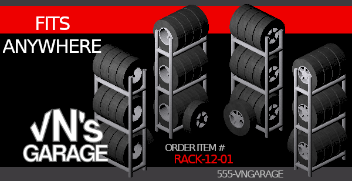

# Veracious Network's Garage (Project Zomboid Mod)

Links

---

Veracious Network's Garage is a mod for Project Zomboid that provides the following features:

* Tire rack
* (more to come)

## Tire Rack

The tire rack is a storage container that can hold up to 12 tires, (or more if you are organized).
This is a 1x1 tile object that can be placed on the ground and accepts just tires.

A notable feature of this tire rack is that it displays the amount of tires stored.
ie: if you store 5 tires, you will see 5 tires on the rack.

## Installation

* Mod Name = VNGarage
* ModID = 3133520800

## Development

Check the [Development Guide](DEVELOPMENT.md) for information on working with this repository.