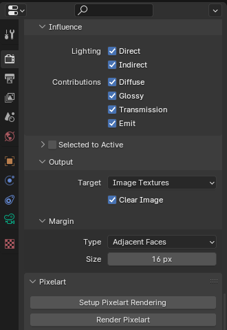
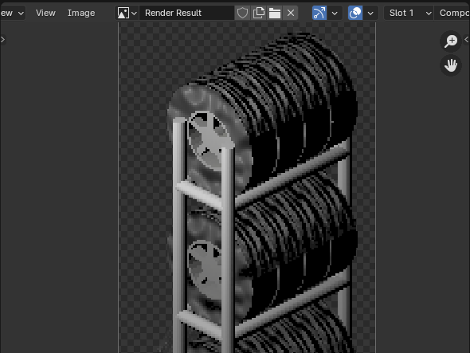

# Rendering the Tire Rack

Original versions of the tire rack were generated with Inkscape (designs/vn_tire_rack_unpainted.svg).
This is effective for quickly prototyping the design, but does not translate well to pixel art.

## Blender

As such Blender was used for the newest version of sprites.
The PixelArt plugin (supplemental/BlenderResources/addon-pixelart) is used for rendering.

The tire rack model and all tires are created as individual models, each paintable and toggleable.

## Adjusting

To render a rack, rotate the camera and light around the "3D Cursor Point" to the required position.
DO NOT rotate the rack itself, as the tires do not like to stay in the rotated position.
There's probably some Blender setting I'm missing, but rotating the camera seems to work well enough.


Select which tires and assets to include in the export. This is done simply by checking or unchecking the containers.


## Rendering

When the containers and camera are set as necessary, generate the pixel art with Output -> Render Pixelart.



Lastly export the pixelart from the Image -> Save As option.



For naming conventions,

* 0 = North-facing (positioned along south wall)
* 1 = East-facing (positioned along west wall)
* 2 = South-facing (positioned along north wall)
* 3 = West-facing (positioned along east wall)

```
                /   \
            /           \
        /  1/E        2/S   \
    /                           \
    \                          /
        \  0/N         3/W /
            \          /
                \  /
```

Individual tiles should be exported to `designs/tiles/` in a folder specific to that resource.

## Merging

Once all 52 tiles are exported, merge them together in a single spritesheet in `designs/tilemaps/`.
This can be done manually with gimp just by dragging the files into a single file and positioning them.

To make this process easier, `designs/tilesheet-template.xcf` is included pre-sized for 64x 128x256
sprites with guides for positioning the sprites precisely.  A position overlay is also included for reference,
though be sure to hide this layer prior to exporting.

Export the merged tilemap as a PNG in `designs/tilesets/` with an identifiable name. 
This filename will form the basis of requesting the sprite in game.

## Packing

Run Tilezed and select Tools -> .pack files -> Create pack file.  From there select the tilesets directory,
set destination path in `supplemental/Packs`, and save.

For new tilesets, you will also need to create a tile for the new sprites, along with your expected properties.

## Deploying / Testing

To test the new pack, run `./deploy_local.sh` to export the pack, LUA, and mod files to a local directory for testing.