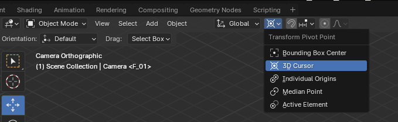
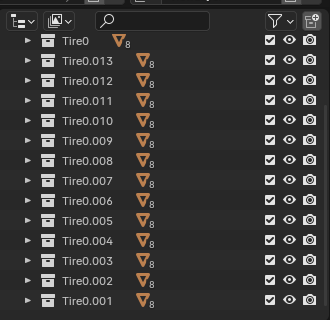
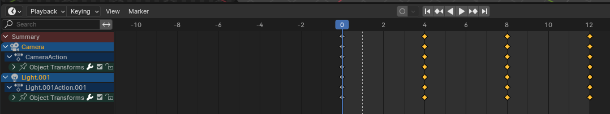

# Rendering the Tire Rack

Original versions of the tire rack were generated with Inkscape (designs/vn_tire_rack_unpainted.svg).
This is effective for quickly prototyping the design, but does not translate well to pixel art.

## Blender

As such Blender was used for the newest version of sprites.
The PixelArt plugin (supplemental/BlenderResources/addon-pixelart) is used for rendering.

The tire rack model and all tires are created as individual models, each paintable and toggleable.

## Adjusting

To render a rack, rotate the camera and light around the "3D Cursor Point" to the required position.
DO NOT rotate the rack itself, as the tires do not like to stay in the rotated position.
There's probably some Blender setting I'm missing, but rotating the camera seems to work well enough.




Select which tires and assets to include in the export. This is done simply by checking or unchecking the containers.



## Rendering

When the containers and camera are set as necessary, generate the pixel art CTRL+F12.

For convenience, an animation profile is set to render each orientation in a different frame.



For naming conventions,

* 0 = North-facing (positioned along south wall)
* 1 = East-facing (positioned along west wall)
* 2 = South-facing (positioned along north wall)
* 3 = West-facing (positioned along east wall)

```
                /   \
            /           \
        /  1/E        2/S   \
    /                           \
    \                          /
        \  0/N         3/W /
            \          /
                \  /
```

Individual tile snapshots should be exported to `designs/render/`.

To assist with naming conventions, the `sort_render.sh` script can be used.

1. Run ./sort_render.sh [COLOR_NAME]
2. Will prompt for 0 through 13 for exports.  CTRL+F12 on each tire config when prompted.
3. When completed, `montage.sh` will be executed with the selected colour, creating the spritemap.

## Packing

Run Tilezed and select Tools -> .pack files -> Create pack file.  From there select the tilesets directory,
set destination path in `supplemental/Packs`, and save.

For new tilesets, you will also need to create a tile for the new sprites, along with your expected properties.

## Deploying / Testing

To test the new pack, run `./deploy_local.sh` to export the pack, LUA, and mod files to a local directory for testing.